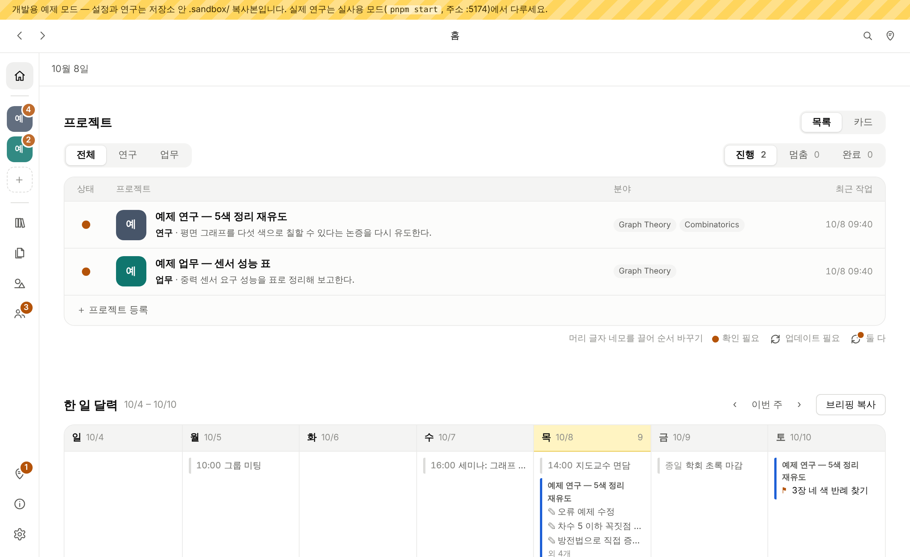
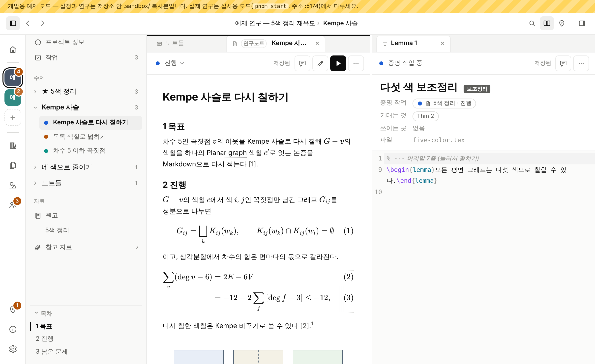

# Emergence Workbench

**A trustworthy workbench where researchers and AI agents work together. Build up knowledge and evidence, and turn it into new discoveries.**

[한국어](#한국어)

Emergence Workbench is a local research app for people who run several research projects at once. Notes, derivations, papers, figures, manuscripts, to-dos and logs live in one window, while every record stays a plain file in your own git repositories, where coding agents such as Claude Code and Codex can read it and pick up the work.



## What it does

- **Projects, topics and notes.** Each research repository keeps its own structure. The app adds a `workbench/` folder for research notes (Markdown + KaTeX or LaTeX), topics, statements, logs and to-dos, and reads the manuscript, task list and bibliography the repository already has.
- **Shared library.** Concept notes, papers and figures that every project uses live in one separate library repository, with `[@key]` citations into a shared `references.bib`.
- **Read and ask.** Read a PDF or a note, select a passage, leave a comment or a question, and an agent answers next to it.
- **Delegated work.** Hand a task to an agent, then approve or ask for changes on its report in the Work tab.
- **Safe with agents.** Writes check the file hash they read first, so the app never overwrites a change made outside it. Everything the screen does is also a JSON API (`GET /api` lists the routes).
- **LaTeX.** Compile notes and manuscripts with shared templates (article, PRL, PRB, beamer), with SyncTeX jumps between source and PDF.



## Why another research app

- **Your files stay the source of truth.** Notes are Markdown or LaTeX, records are YAML and plain text, and all of it sits in your own git repositories. The app adds a `workbench/` folder and an index it can rebuild; nothing lives only inside the app.
- **Agents come in through a safe door.** Claude Code and Codex read projects, notes and tasks through an MCP entry point ([docs/agent-mcp.md](docs/agent-mcp.md)) that uses the same API as the screen. Edits send the hash they read, so neither you nor an agent silently overwrites the other.
- **Manuscripts are never rewritten behind your back.** Saving a file you did not change leaves its bytes alone, and `pnpm safety:check` runs the real API against copies of your repositories to prove it.
- **You stay the one who decides.** Agents report; you approve or ask for changes in the Work tab, and the decision is kept in the project log.

## Try it with sample data

You need Node 22 and pnpm. TeX Live (latexmk, xelatex, synctex) is only needed for compiling.

```sh
pnpm install
pnpm dev:en     # sample mode in English: server :8130, screen http://localhost:5173
pnpm dev        # the same with the Korean sample
```

Sample mode (`RW_SANDBOX=1`) copies a sample research project and a sample library into `.sandbox/` (`.sandbox-en/` for the English sample) and never touches your real config or repositories.

## Use it for real (macOS)

```sh
pnpm service:install    # build the screen and register a background service at http://127.0.0.1:5174
pnpm service:restart    # rebuild and restart after an update
```

Setup details (service, app icon, Dock, development) are in [docs/mac-setup.md](docs/mac-setup.md). To let Claude Code or Codex read your projects, register the MCP entry point: [docs/agent-mcp.md](docs/agent-mcp.md). The app settings live in `~/.config/research-workspace/config.yaml`. Your private records (app feedback, settings backup, workbench folders that no research repository tracks) go to a personal private repository, set with `personalRepo:` in that file (`apps/server/src/personalRepo.ts`). Without it, feedback stays on this computer and nothing is uploaded.

The interface is in English and Korean. It follows your browser language at first; change it in Settings › Display › Language.

## Repository layout

| Folder | What it holds |
| --- | --- |
| `apps/server` | Local server: projects, notes, library, compile, file watching, JSON API |
| `apps/web` | The screen (React, CodeMirror, pdf.js) |
| `packages/core` | Pure functions shared by both |
| `fixtures/` | Sample data for `pnpm dev` and tests |
| `templates/` | Starting templates for a shared library and LaTeX formats |
| `docs/` | Design system and working rules for agents |

Agents working on this repository start from [AGENTS.md](AGENTS.md) and [CLAUDE.md](CLAUDE.md). The screen reference is [docs/design-system.md](docs/design-system.md).

Questions go to Discussions, bugs and requests to Issues, and code changes to a pull request from a fork: see [CONTRIBUTING.md](CONTRIBUTING.md).

## License

[MIT](LICENSE).

---

## 한국어

**연구자와 AI 에이전트가 함께 일하는 신뢰할 수 있는 작업대. 지식과 근거를 쌓아 새로운 발견으로.**

Emergence Workbench(연구 작업대)는 여러 연구를 함께 진행하는 연구자를 위한 로컬 앱입니다. 노트·유도·논문·그림·원고·할 일·일지를 한 창에서 다루고, 모든 기록은 내 git 저장소에 평범한 파일로 남아 Claude Code·Codex 같은 코딩 에이전트가 읽고 이어받습니다.

- **프로젝트 › 주제 › 노트.** 연구 저장소의 구조는 그대로 두고 `workbench/` 폴더만 더합니다. 원고·작업 목록·참고문헌은 저장소에 있는 것을 그대로 읽습니다.
- **공유 라이브러리.** 개념노트·논문·그림은 모든 프로젝트가 함께 쓰는 별도 저장소에 둡니다.
- **읽으며 묻기.** PDF나 노트에서 글을 골라 코멘트나 질문을 남기면 에이전트가 그 옆에 답합니다.
- **맡긴 일.** 에이전트에게 일을 맡기고, 작업 탭에서 보고서를 승인하거나 수정 요청합니다.
- **에이전트와 안전하게.** 읽을 때 받은 hash를 확인하고 쓰므로 바깥에서 고친 내용을 덮어쓰지 않습니다. 화면이 하는 일은 모두 JSON API로도 할 수 있습니다(`GET /api`).

**다른 점:** 모든 기록은 내 git 저장소의 평범한 파일(Markdown·LaTeX·YAML)이고, 에이전트는 화면과 같은 API를 쓰는 MCP 입구([docs/agent-mcp.ko.md](docs/agent-mcp.ko.md))로 들어와 hash를 확인하고 씁니다. 고치지 않은 원고는 저장해도 바이트가 그대로이고(`pnpm safety:check`로 확인), 에이전트의 보고는 내가 작업 탭에서 승인합니다.

**예제로 써 보기:** `pnpm install` 뒤 `pnpm dev`(영어 예제는 `pnpm dev:en`)를 실행하고 http://localhost:5173 을 엽니다. 예제 연구와 예제 라이브러리를 `.sandbox/`에 복사해 쓰므로 실제 설정과 저장소는 건드리지 않습니다.

**맥에서 실사용:** `pnpm service:install`로 백그라운드 서비스(http://127.0.0.1:5174)를 등록하고, 업데이트 뒤에는 `pnpm service:restart`를 실행합니다. 자세한 설정은 [docs/mac-setup.ko.md](docs/mac-setup.ko.md)에 있습니다. 설정은 `~/.config/research-workspace/config.yaml`에 있습니다. 피드백·설정 백업 같은 개인 기록은 그 파일의 `personalRepo:`에 적은 비공개 개인 저장소에 올라갑니다. 정하지 않으면 이 컴퓨터에만 남고 아무것도 올리지 않습니다.

화면은 영어와 한국어를 지원합니다. 브라우저 언어를 따르고, 설정 › 화면 › 언어에서 바꿀 수 있습니다.

라이선스: [MIT](LICENSE).
