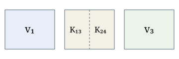

## 목표

차수 5인 꼭짓점 $v$의 이웃을 Kempe 사슬로 다시 칠해 $G-v$의 색칠을 하나의 [[Planar graph]] 색칠 $c'$로 잇는 논증을 Markdown으로 다시 적는다 [@doe2004structure].

## 진행 \label{sec: progress}

$G-v$의 색칠 $c$에서 색 $i$, $j$인 꼭짓점만 남긴 그래프 $G_{ij}$를 성분으로 나누면

$$
\begin{equation}
G_{ij} = \bigsqcup_k K_{ij}(w_k), \qquad K_{ij}(w_k) \cap K_{ij}(w_l) = \emptyset
\label{eq: decomposition}
\end{equation}
$$

이고, 삼각분할에서 차수의 합은 면마다의 몫으로 갈라진다.

$$
\begin{align}
\sum_v (\deg v - 6) &= 2E - 6V \label{eq: charge} \\
&= -12 - 2 \sum_f \left[ \deg f - 3 \right] \le -12, \qquad V - E + F = 2
\end{align}
$$

다시 칠한 색칠은 Kempe 바꾸기로 쓸 수 있다 [@lorem1988sufficiency].^[바꾸기는 $u \in K_{ij}(w)$에서 $s_{ij}(c)(u) = \{i, j\} \setminus \{c(u)\}$, 그 밖에서는 $c(u)$이다.]
<!-- 예전 LaTeX 노트에서 옮길 때 남긴 메모는 이렇게 숨긴다 -->

**Proof.** $v_3 \notin K_{13}(v_1)$이면 식 \eqref{eq: decomposition}의 성분 가운데 $v_1$을 담은 것(그림 \ref{fig: parts})만 바꾸면 된다. ∎

공용 그림 라이브러리의 지도 그림으로 보면 다음과 같다.

![[세 나라 지도|240]]

## 남은 문제

- 네 색의 경우 ($K_{13}$과 $K_{24}$가 엉킬 때)의 처리
- [[Vertex splitting]] 방법과의 관계
